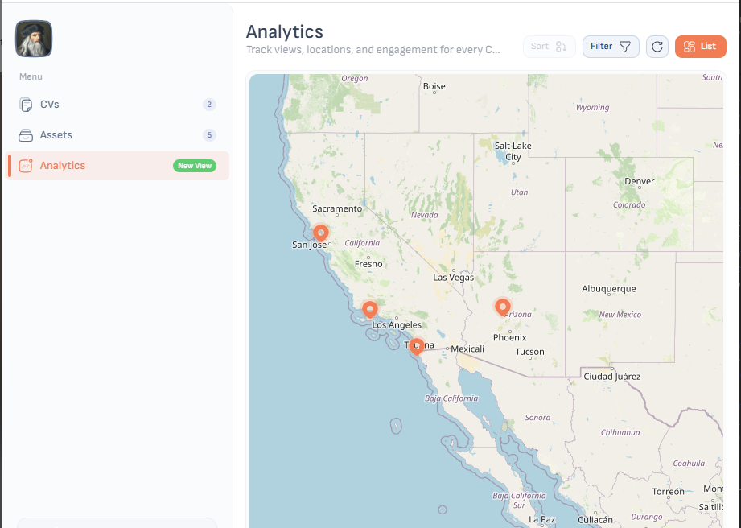

# Analytics Overview

Below is a snapshot of the **Analytics** page on CVinci, showing how users can track views, locations, and engagement for every CV. 

---

## Key Features

### 1. Geolocation Map Mode  
- **Visualize Viewer Locations**  
  On the map, each marker represents a city or region where a link was opened. You can instantly see geographic patterns—e.g., clusters in Los Angeles, Phoenix, or San Jose (as shown above).  
- **Click to Get Details**  
  Clicking any marker brings up a detailed view, showing:
  - **Total Views** from that location  
  - **Time Spent** by viewers (e.g., average seconds or minutes)  
  - **Scroll Depth** (how far down the CV page users went)  
  - **Attachment Downloads** (if any assets were downloaded)  

### 2. List View Mode  
- **Switch to List Format**  
  Instead of the map, toggle to **List** mode (button in the top-right). Here, each row represents a single visit, displaying:
  - **Location** (city/region)  
  - **Timestamp** (date and time of view)  
  - **Duration** (how long the viewer stayed on the page)  
  - **Device Type** (desktop, mobile, or tablet)  
  - **Referrer** (LinkedIn, email share, direct URL, etc.)  

### 3. “New View” Badge  
- **Real-Time Notifications**  
  Whenever a new visitor opens your CV link, a green **New View** badge appears next to **Analytics** in the sidebar. This highlights fresh activity so you know immediately when someone engages.  
- **Click to Refresh Data**  
  The refresh icon in the header updates the map or list to show the latest visits—no page reload needed.

---

## How to Interpret Analytics Data

1. **Identify High-Interest Locations**  
   - Look for clusters of markers on the map. If multiple views originate from a single city, consider customizing your outreach or adding localized references.  
2. **Evaluate Engagement Duration**  
   - Click a marker or check the list view to see how long visitors linger. Longer durations usually indicate deeper engagement—perhaps they downloaded your attached portfolio or read through all sections.  
3. **Track Attachment Downloads**  
   - In the detailed popup (after clicking a location), note if any supporting documents were downloaded. This tells you which assets (e.g., cover letter, portfolio PDF, video) resonated most.  
4. **Monitor Referral Sources**  
   - The list view shows where traffic came from: direct link, LinkedIn, job board, or email. Use this insight to double down on channels that drive the most qualified views.  
5. **Use “New View” Indicators**  
   - Whenever you see a **New View** badge, click **Analytics** to dive into fresh data. This real-time feedback allows you to follow up promptly—especially useful if you just applied to a job and want to send a quick thank-you or personalized note.

---

## Tips & Best Practices

- **Customize CV Versions**  
  Generate multiple CV links (e.g., `cvinci.me/yourname-design` vs `cvinci.me/yourname-marketing`) and compare analytics across them. See which version generates more engagement in specific regions or industries.  
- **Refine Your Content**  
  If the heatmap shows viewers skimming certain sections, try rewriting headlines or adding bullet points. Over time, use analytics to optimize for the most popular segments.  
- **Leverage Attachment Data**  
  If you notice a spike in “Design Portfolio” downloads but few “Cover Letter” downloads, consider revising the cover letter to be more compelling or swapping it out for a different asset.  
- **Monitor Referral Trends**  
  If LinkedIn sends 70% of your traffic, update your LinkedIn bio to highlight your CV link. If email campaigns generate the most views, double-check that your email signature includes the correct URL (`cvinci.me/yourname`).  
- **Engage Immediately**  
  Real-time “New View” alerts let you know exactly when someone is looking at your CV. If it’s a hiring manager or recruiter, consider sending a quick follow-up message while their interest is fresh.

---

## Next Steps

- Visit the **Analytics** page on CVinci to explore your own view data:  
  [CVinci Analytics](https://cvinci.me/analytics)  
- Compare map mode and list view to gain both macro- and micro-level insights into reader behavior.  
- Experiment with customizing slugs, swapping attachments, and adjusting templates. Then track how these changes impact engagement metrics regionally and over time.

Turn every CV view into actionable intelligence—start using CVinci’s powerful analytics today!